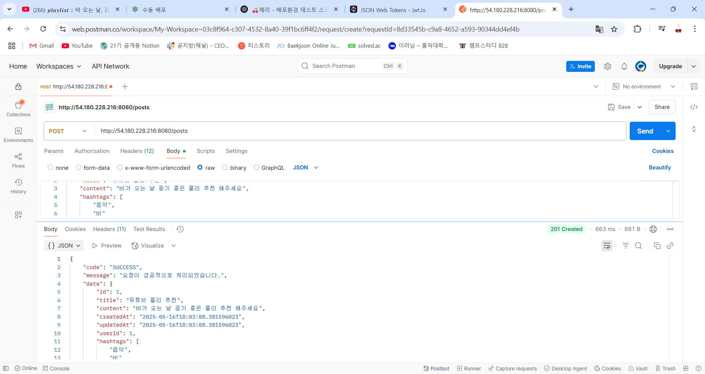
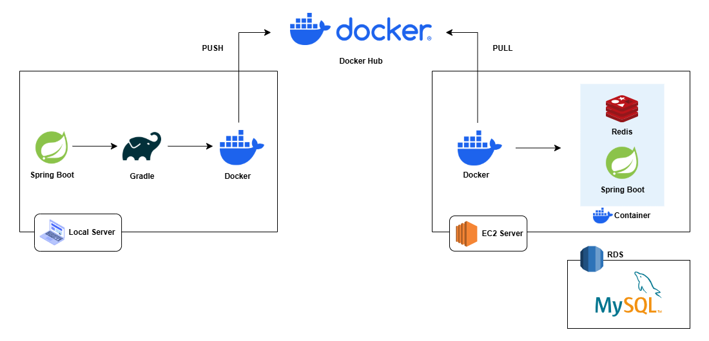

# 🌐DEPLOY
## 🧭배포 사이트
[네이버 지식iN 클론](http://54.180.228.216:8080/)

## 🐞첫 번째 문제
### 문제 상황
배포를 완료한 이후 postman을 통해서 api 테스트를 할 때, 일부 api에 문제가 있음을 발견했다.
회원가입 요청 시 성공적으로 응답을 반환받았으나, 가입한 email과 password로 로그인 요청을 보낼 경우 `403 FORBIDDEN`을 받았다.

### 배포한 환경에서 백엔드 로그 확인하는 법
EC2 컴퓨터(=서버)에 Spring Boot 프로젝트를 Docker 컨테이너 안에서 실행하고 있다. 
즉, EC2에 들어가면 Docker가 돌아가고 있고, 그 안에 Spring Boot 앱이 실행 중이다.
SSH는 Secure Shell의 약자로, EC2 컴퓨터로 안전하게 원격 접속하는 방식이다. 

따라서 EC2 서버에 SSH로 들어가서 ```docker ps``` 를 입력하면 실행 중인 Docker 컨테이너 목록을 보여준다. 

```
CONTAINER ID   IMAGE                   COMMAND
fb9bdd5a6507   yeonee911/deploy-test   "java -jar /app.jar"
```
`CONTAINER ID`는 실행 중인 컨테이너의 고유 ID이고, `IMAGE`는 이 컨테이너가 어떤 이미지로부터 만들어졌는지, 
`COMMAND`는 컨테이너가 실행될 때 수행된 명령어이다. 
여기서 `java -jar /app.jar`은 자바로 /app.jar 파일을 실행하라는 뜻으로 Spring Boot 애플리케이션을 실행하라는 것이다. 

즉 Docker 컨테이너 안에서 로그가 찍히고 있다. 

다음과 같은 명령어를 입력하면 로그를 확인할 수 있다.

```
sudo docker logs spring-knowledgein-21st
```

### 원인 파악
```angular2html
Caused by: io.lettuce.core.RedisConnectionException: Unable to connect to host.docker.internal:6379
```
🚨 Docker 컨테이너 내부에서 `host.docker.internal`로 Redis에 연결하려고 했는데, 그 주소를 못 찾겠다는 뜻이다.

`host.docker.internal`은 Windows/Mac에서만 동작하는 호스트 주소 전용 예약어다.
하지만 EC2는 리눅스고, Docker도 리눅스 기반에서 도는 중이다. 
따라서 `host.docker.internal`이라는 주소가 존재하지 않고, Redis연결을 못해서 로그인 후 토큰 저장에 실패한다. 
결과적으로 예외 발생하고 Spring Security에서 인증에 실패하여 `403 Forbidden`이 뜨는 것이다. 

기존 application.yml을 살펴보자.
```angular2html
spring:
  data:
    redis:
      host: host.docker.internal
      port: 6379
```
정말로 `host.docker.internal`을 확인할 수 있다.

### 해결
이 경우 해결책은 두 가지이다. 하나는 **docker 이미지에 redis를 포함**하는 것이고 다른 하나는 **서버에 redis를 설치**하는 것이다.
<br> docker 이미지에 redis를 포함시킨다는 의미를 알아보자. 먼저 docker 용어의 개념을 살펴보면, docker 이미지는 어떤 프로그램을 실행하기 위한 모든 정보가 담겨 있는 덩어리이고 
docker 컨테이너는 이 이미지를 기반으로 만들어진 실제 실행중인 인스턴스이다. 즉 redis라는 이미지를 생성하면 그 이미지를 기반으로 redis 컨테이너를 만들고 이를 실행시키면 redis서버가 돌아가는 것이다. 
그리고 기존의 db도 docker 이미지에 포함시키는 방법을 통해 서버를 띄웠다. 서버에 redis를 설치하는 것은 EC2 자체에 설치된다. 
<br> 만약 서버에 직접 Redis를 설치하면 버전, 설정, 경로 충돌 문제 등이 발생할 가능성이 있고 포트 관리 등 모든 것을 수동 관리해줘야한다. 
그러나 Docker 이미지로 Redis를 실행하면 격리성이 높고 컨테이너마다 포트 분리도 가능하다. 

따라서 docker 이미지에 redis를 포함시켜서 문제를 해결하자!

```angular2html

  redis:
    image: redis:latest
    container_name: redis
    ports:
      - "6379:6379"
    networks:
      - network

  web:
    container_name: spring-knowledgein-21st
    image: yeonee911/deploy-test
    ports:
      - "8080:8080"
    depends_on:
      - db
      - redis
    networks:
      - network
    env_file:
      - .env
    restart: always
    volumes:
      - app:/app
```
주의할 점은 단순히 배포만 다시 진행하는 것이 아니라 EC2 서버에  `docker-compose.yml` 파일도 업데이트 해줘야한다.
그리고 docker ps를 통해서 redis가 띄워지는지 확인한다. 변경 사항이 생겼으므로 다시 배포를 진행해준다.. (자동배포를 얼른 배우고 싶다... 너무 귀찮음)

## 🐞두 번째 문제
### 문제 상황
이번에는 게시글을 추가하는 API에서 문제가 생겼다. 로그인한 사용자, 즉 인증된 사용자가 게시글을 추가하려는 경우 `INTERNAL_SERVER_ERROR`가 뜬다.
로그를 확인해보니 원인은 `NullPointerException`이었다. 내부 코드에서 null 객체를 잘못 사용해서 에러 발생했고 예외를 처리하지 않아서 500으로 응답이 온 것이다.

즉, 인증 자체는 성공했지만, 이후 로직에서 문제가 생긴 것이다.

### 원인 파악
기존 코드는 아래와 같다
```angular2html
@Slf4j
@RequiredArgsConstructor
public class JwtAuthorizationFilter extends OncePerRequestFilter {

    private final JwtUtil jwtUtil;
    private final UserDetailsServiceImpl userDetailsService;

    @Override
    protected void doFilterInternal(HttpServletRequest request, HttpServletResponse response,
                                    FilterChain filterChain) throws ServletException, IOException {

        String token = jwtUtil.getJwtFromHeader(request);

        if (token != null && jwtUtil.validateToken(token)) {
            Claims claims = jwtUtil.getUserInfoFromToken(token);
            String email = claims.getSubject();

            // roles를 JWT에서 직접 꺼냄
            List<String> roles = (List<String>) claims.get("auth");

            // roles -> GrantedAuthority 리스트로 변환
            List<GrantedAuthority> authorities = roles.stream()
                    .map(SimpleGrantedAuthority::new)
                    .collect(Collectors.toList());

            // 인증 객체 생성
            UsernamePasswordAuthenticationToken authentication =
                    new UsernamePasswordAuthenticationToken(email, null, authorities);
            authentication.setDetails(new WebAuthenticationDetailsSource().buildDetails(request));

            SecurityContext context = SecurityContextHolder.createEmptyContext();
            context.setAuthentication(authentication);
            SecurityContextHolder.setContext(context);
        }
        filterChain.doFilter(request, response);
    }
}
```
원인은 인증 객체를 생성하는 부분이었다. 

```angular2html
UsernamePasswordAuthenticationToken authentication =
    new UsernamePasswordAuthenticationToken(email, null, authorities);
```
여기서 `UsernamePasswordAuthenticationToken`객체를 생성할 때 첫번째 인자로 email을 넣어주고 있는데, 
실제 구현체를 살펴보면

```angular2html
    public UsernamePasswordAuthenticationToken(Object principal, Object credentials, Collection<? extends GrantedAuthority> authorities) {
        super(authorities);
        this.principal = principal;
        this.credentials = credentials;
        super.setAuthenticated(true);
    }
```
이처럼 첫번째 인자는 principal, 인증된 객체이다. 그러나 기존 코드에서는 email(String)을 넘겨주며 문제가 발생했다.

결과적으로 Spring Security는 `Authentication.getPrincipal()`을 문자열로 판단하고 
Controller에서 `@AuthenticationPrincipal UserDetailsImpl`로 주입받으려고 하니까 타입이 맞지 않아 null이 된 것이다.
```angular2html
@PostMapping("/posts")
    @SecurityRequirement(name = "Authorization")
    @Operation(
            summary = "게시글 추가",
            description = "새로운 게시글을 등록합니다"
    )
    public ResponseEntity<ApiResponse<PostResponse>> savePost(
            @RequestBody PostAddRequest request,
            @AuthenticationPrincipal UserDetailsImpl userDetailsImpl
    ) {
        Post savedPost = postService.savePost(request, userDetailsImpl.getUserId());
        return ResponseEntity
                .status(HttpStatus.CREATED)
                .body(ApiResponse.success(PostResponse.from(savedPost)));
    }
```
여기서 NPE가 난 것 같다..!

### 해결
해결책은 간단하다. principal에 String이 아닌 인증된 객체를 넘겨주면 된다!
```angular2html
UserDetailsImpl userDetails = (UserDetailsImpl) userDetailsService.loadUserByUsername(email);

UsernamePasswordAuthenticationToken authentication =
    new UsernamePasswordAuthenticationToken(userDetails, null, userDetails.getAuthorities());
```
email로 객체를 불러오고 `UserDetailsImpl`을 principal로 직접 넣는다.

### POSTMAN 응답 확인


## 💡한 가지 팁
docker hub가 안 켜질때..!

1. 작업관리자에서 docker를 검색하고 관련 모든 작업을 끝낸다
2. docker hub를 관리자 권한으로 실행한다. 

## 🎨배포 환경 다이어그램
