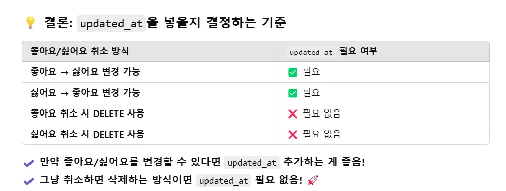

# 🛠️ERD 설계

## 1. 이미지는 게시글 엔티티 안에 안 넣고 따로 관리하는 걸까?

### 결론

이미지 테이블을 따로 만드는 것이 더 유연하고 확장성 좋음

- **게시글과 이미지의 관계를 1:N으로 쉽게 관리 가능**
- **파일 저장 방식이 유연해지고, 정렬, 삭제 처리도 쉬워짐**
- **DB에는 이미지 URL만 저장하고, 실제 파일은 외부 스토리지 활용**

**👉 그래서 `Post_Image` 같은 별도 테이블을 만들어서 관리하는 게 더 좋음.**

---

## 2. 해시태그 엔티티와 게시글 해시태그 엔티티는 왜 따로 만드는 걸까?

### 결론

1. **중복 방지 및 데이터 일관성 유지**
    - 해시태그 자체는 하나의 개념(예: #여행, #맛집)이지만, 여러 게시글에서 동일한 해시태그를 사용할 수 있음.
    - 게시글마다 해시태그를 개별 저장하면 해시태그가 수천 개의 게시글에서 중복 저장될 수 있음.
    - 따라서 **해시태그 엔티티(Hashtag)**를 따로 두고, 게시글의 해시태그(PostHashtag) 엔티티는 게시글과 해시태그 간의 N:M 관계를 관리하는 역할을 함.

2. **검색 및 성능 최적화**
    - 해시태그 엔티티에서 미리 해시태그를 정리하면 검색 시 중복 데이터를 제거하고 성능 최적화가 가능함.

3. **관계형 데이터베이스 설계 원칙**
    - 게시글(Post)과 해시태그(Hashtag)는 N:M 관계이므로 중간 테이블(PostHashtag)을 사용하여 관계를 표현함.

**👉 `Hashtag` 테이블 → 해시태그 자체 (id, name)**  
**👉 `PostHashtag` 테이블 → 게시글과 해시태그 간의 연결 (post_id, hashtag_id)**  
✅게시글과 해시태그 간의 **다대다 관계를 풀기 위해서** 관계 테이블을 이용하는 것!

---

## 3. 댓글과 대댓글은 엔티티를 구분해야 할까?
1. 댓글과 대댓글 엔티티를 구분해야 할까?
2. 댓글 엔티티를 자기 자신 참조?

### 결론

댓글과 대댓글을 **하나의 댓글 엔티티에서 부모 ID를 저장**하여 구분할 수 있음.

---

## 4. 좋아요, 싫어요 엔티티를 구분할까? 아니면 하나의 엔티티로 통일할까?

### 결론

좋아요와 싫어요를 **따로 관리**하는 것이 더 유리할 수 있지만, 일부에서는 하나의 테이블로 통합해서 관리하는 방법도 고려됨.

- 좋아요 취소 기능이나 싫어요 기능 변경 시 문제가 생길 수 있기 때문에, 별도의 테이블로 관리하는 것이 더 안정적임.

---

## 5. 좋아요/싫어요 테이블에는 `updated_at`을 넣을지?

### 결론

네이버 웹툰에서 **좋아요 → 싫어요 변경 방법** 실험 결과:

- **좋아요 → 싫어요 변경 방법**: 좋아요를 누른 후 취소하고 싫어요를 눌러야 함. 기존에 좋아요를 눌렀다면 싫어요 선택이 불가하고, 다시 취소하고 새로운 선택을 해야 함.

`updated_at` 필드는 이런 기능을 추적하는 데 유용할 수 있음.

---

## 6. `created_at`과 `updated_at` 많이 들어가는 이유

### 결론

1. **데이터 변경 이력 추적 가능**
    - 데이터가 언제 생성되었는지 알 수 있어 분석, 디버깅, 감사 로그 등에 유용함.

2. **정렬 및 페이징 처리 용이**
    - `ORDER BY created_at DESC`를 사용하여 최신 데이터를 정렬할 수 있음.
    - 무한 스크롤, 페이지네이션 구현 시 효과적임.

3. **데이터 무결성 및 보안 강화**
    - 특정 데이터가 언제 추가되었는지 기록되어 부정 삽입을 탐지할 수 있음.

4. **백업 및 데이터 복구 용이**
    - 특정 시점 기준으로 데이터 복원이 가능함.

---

## 7. PK의 자료형은 `long`? `int`?

### 결론

- `Wrapper class(Long)`을 사용하는 것이 좋음. 왜냐하면 `null` 값을 표현할 수 있기 때문.
- **Long을 사용하는 이유**는 Integer보다 더 넓은 표현 범위를 제공하기 때문임.

**👉 `BigInt`와 같은 큰 범위의 ID를 사용해야 할 필요가 있을 때 Long을 사용하는 것이 바람직함.**

[참고](https://www.inflearn.com/community/questions/260916/id%EA%B0%92%EC%9D%84-long-%ED%83%80%EC%9E%85%EC%9C%BC%EB%A1%9C-%EC%A7%80%EC%A0%95%ED%95%98%EB%8A%94-%EC%9D%B4%EC%9C%A0%EA%B0%80-%EB%94%B0%EB%A1%9C-%EC%9E%88%EB%82%98%EC%9A%94)

---

## 8. 다른 필드에도 `wrapper`? `primitive`?

### 결론

- **PK**는 **Wrapper class**를 사용하는 것이 좋음.
- 나머지 필드도 **Wrapper class**로 통일하는 것이 좋음.

**👉 Wrapper class는 `null`을 표현할 수 있기 때문에, primitive type은 `0`이 기본값이 되어 의미를 정확하게 전달할 수 없을 수 있음.**

[참고](https://0soo.tistory.com/121?category=600115)

---

## 9. 네이밍 룰

### 결론

**Use singular nouns for entities** ⇒ **단수를 사용하자**

- 엔티티는 주로 데이터 모델에서 중요한 객체나 개념을 나타내며, 단수형 명사를 사용해야 함.
- 예: `Customer` 대신 `Customers`, `Cust`, `CUS` 사용 금지.

**👉 네이밍 룰과 관련된 자세한 내용은 [Medium](https://medium.com/@fbnlsr/the-table-naming-dilemma-singular-vs-plural-dc260d90aaff)에서 확인 가능.**

---

## 10. CHAR vs VARCHAR

### 결론

- **CHAR**는 고정길이 데이터 타입이고, **VARCHAR**는 가변길이 데이터 타입.

**👉 CHAR는 고정된 길이를 갖는 데이터에 적합하고, VARCHAR는 가변 길이 데이터에 적합함.**

[참고](https://kghworks.tistory.com/177)에서 확인 가능.

---

# 🛠️모델링 결과

### user 테이블
- **설명**: 사용자(회원) 정보를 저장하는 테이블입니다.
- **속성**:
    - `user_id`: `BIGINT` - 사용자 고유 식별자, PK
    - `name`: `VARCHAR(255)` - 사용자의 이름
    - `email`: `VARCHAR(255)` - 사용자의 이메일 주소
    - `password`: `VARCHAR(255)` - 사용자의 비밀번호

### post 테이블
- **설명**: 사용자가 작성한 게시글을 저장하는 테이블입니다.
- **속성**:
    - `post_id`: `BIGINT` - 게시글 고유 식별자, PK
    - `user_id`: `BIGINT` - 게시글 작성자의 `user` 테이블을 참조하는 FK
    - `title`: `VARCHAR(255)` - 게시글 제목
    - `content`: `VARCHAR(255)` - 게시글 내용
    - `created_at`: `DATETIME` - 게시글 생성 시간
    - `updated_at`: `DATETIME` - 게시글 수정 시간

### baseComment 테이블
- **설명**: 게시글에 달린 댓글을 저장하는 테이블입니다.
- **속성**:
    - `comment_id`: `BIGINT` - 댓글 고유 식별자, PK
    - `user_id`: `BIGINT` - 댓글 작성자를 나타내는 FK
    - `post_id`: `BIGINT` - 댓글이 달린 게시글을 참조하는 FK
    - `parent_id`: `BIGINT` - 부모 댓글을 참조하는 FK
    - `content`: `VARCHAR(255)` - 댓글 내용
    - `created_at`: `DATETIME` - 댓글 등록 시간
    - `updated_at`: `DATETIME` - 댓글 수정 시간

### comment_like 테이블
- **설명**: 댓글에 달린 좋아요를 저장하는 테이블입니다.
- **속성**:
    - `comment_like_id`: `BIGINT` - 좋아요 고유 식별자, PK
    - `user_id`: `BIGINT` - 좋아요를 누른 회원을 나타내는 FK
    - `comment_id`: `BIGINT` - 좋아요가 눌린 댓글을 참조하는 FK
    - `created_at`: `DATETIME` - 좋아요 등록 시간

### comment_dislike 테이블
- **설명**: 댓글에 달린 싫어요를 저장하는 테이블입니다.
- **속성**:
    - `comment_dislike_id`: `BIGINT` - 싫어요 고유 식별자, PK
    - `user_id`: `BIGINT` - 싫어요를 누른 회원을 나타내는 FK
    - `comment_id`: `BIGINT` - 싫어요가 눌린 댓글을 참조하는 FK
    - `created_at`: `DATETIME` - 싫어요 등록 시간

### image 테이블
- **설명**: 게시글의 이미지를 저장하는 테이블입니다.
- **속성**:
    - `image_id`: `BIGINT` - 이미지 고유 식별자, PK
    - `post_id`: `BIGINT` - 이미지가 있는 게시글을 참조하는 FK
    - `image_url`: `VARCHAR(255)` - 이미지 경로

### post_hashtag 테이블
- **설명**: 게시글에 달린 해시태그를 저장하는 테이블입니다.
- **속성**:
    - `post_id`: `BIGINT` - 해시태그가 있는 게시글을 참조하는 FK
    - `hashtag_id`: `BIGINT` - 게시글 해시태그가 있는 해시태그를 참조하는 FK

### hashtag 테이블
- **설명**: 전체 해시태그를 저장하는 테이블입니다.
- **속성**:
    - `hashtag_id`: `BIGINT` - 해시태그 고유 식별자, PK
    - `content`: `VARCHAR(255)` - 해시태그 내용

### 관계 설명
- **user - post**: **1:N**
- **post - baseComment**: **1:N**
- **post - image**: **1:N**
- **post - post_hashtag**: **1:N**
- **hashtag - post_hashtag**: **1:N**
- **user - baseComment**: **1:N**
- **baseComment - baseComment**: **1:N**
- **user - comment_like**: **1:N**
- **user - comment_dislike**: **1:N**
- **baseComment - comment_like**: **1:N**
- **baseComment - comment_dislike**: **1:N**

## 시행착오

### 1. null 여부
처음에 모두 `NOT NULL`을 당연하다는 듯이 넣었는데 대댓글 기능의 경우 본인이 첫 댓글이라면 부모 댓글은 당연히 존재하지 않음. 따라서 부모 댓글 ID는 `NULL` 허용.

## 2. 식별관계, 다중 PK
[관련 블로그 링크](https://rachel0115.tistory.com/entry/JPA-%EB%B3%B5%ED%95%A9%ED%82%A4-%EB%A7%A4%ED%95%91%ED%95%98%EA%B8%B0-EmbeddedId-MapsId-isNew)

### 2-1. equals, hash 오버라이딩 필요 이유

### 2-2. serializable 필요 이유

### 2-3. EmbeddedId, Embeddable 어노테이션

### 2-4. MapsId

# 🔎엔티티 클래스 개발 질문

## 1. 무조건 `@ManyToOne(fetch = FetchType.LAZY)` ?
- `@ManyToOne(fetch = FetchType.LAZY)`는 성능 최적화 측면에서 자주 사용. 
- 이를 사용하면 불필요한 데이터를 로딩하지 않기 때문에 성능을 개선할 수 있습니다.

## 2. CascadeType.ALL, CascadeType.REMOVE와 orphanRemoval 차이점
- **CascadeType.ALL**: 모든 작업을 전파합니다. `PERSIST`, `MERGE`, `REMOVE`, `REFRESH`, `DETACH` 모두 자식 엔티티에 전파됩니다.
- **CascadeType.REMOVE**: `REMOVE` 작업만 전파됩니다. 부모 엔티티가 삭제될 때 자식 엔티티도 삭제됩니다.
- **orphanRemoval**: 부모 엔티티의 연관 관계에서 자식 엔티티가 제거될 때 해당 자식 엔티티가 삭제됩니다. `CascadeType.REMOVE`와 비슷하지만, 연관 관계에서 제거된 객체만 삭제되므로 더 세밀한 제어가 가능합니다.

[StackOverflow 답변 참고](https://stackoverflow.com/questions/27855362/what-is-difference-between-cascadetype-all-cascade-cascadetype-remove-and-orp)

## 3. 파일 구조
- 도메인형 구조를 추천
- [구글 Vignette](https://cheese10yun.github.io/spring-guide-directory/#google_vignette)에서 제공하는 도메인 기반 파일 구조를 따르는 것이 관리와 확장성 측면에서 유리합니다.

# 😭시행착오

1. `user`, `password`, `baseComment`가 예약어라서 SQL에서 에러
    - 해결: `@Table(name="users")` 등으로 예약어에서 변경